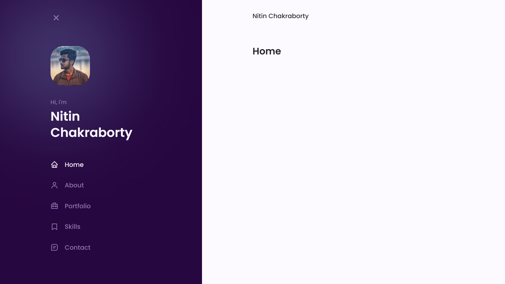

# Responsive Mobile-First Navigation Bar

- Responsive Navigation Bar using HTML, CSS & JavaScript.
- Smooth Scrolling in each Section.
- Developed first with the Mobile-First Methodology.
- Compatible with all Mobile Devices.

The Mobile-First Responsive Navigation Bar Is Created Using HTML, SASS, Boxicons & Some JavaScript!

Facebook : <https://www.facebook.com/NitinChakraborty2001/>

Instagram : <https://www.instagram.com/NitinChakraborty2001/>

Linkedin : <https://www.linkedin.com/in/NitinChakraborty2001/>

Twitter : <https://www.twitter.com/NitinCB2001/>

Youtube : <http://www.youtube.com/c/NitinChakraborty2001/>

Freelancer : <https://www.freelancer.com/u/NitinCB2001/>

Steam : <https://steamcommunity.com/id/NitinChakraborty2001/>

Twitch : <https://www.twitch.tv/NitinChakraborty2001/>
